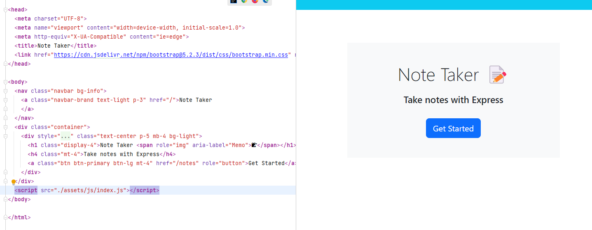

# Note Taker App

A web application for taking and managing notes using Express.

## Table of Contents

- [Description](#description)
- [Features](#features)
- [Installation](#installation)

## Description

The Note Taker App is a simple web application built with Express that allows users to create, view, and delete notes. It provides a user-friendly interface for managing your notes efficiently.

## Features

- Create new notes with titles and text.
- View existing notes.
- Delete notes you no longer need.
- Responsive design for a seamless experience on various devices.

## Installation

1. Clone the repository:

   ```bash
   git clone https://github.com/Nurshat01/Note-Taker-App.git
